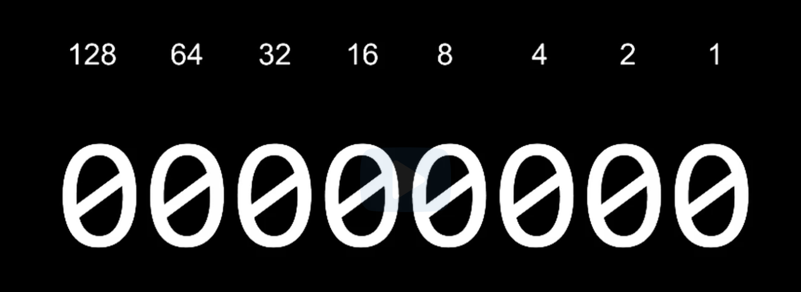
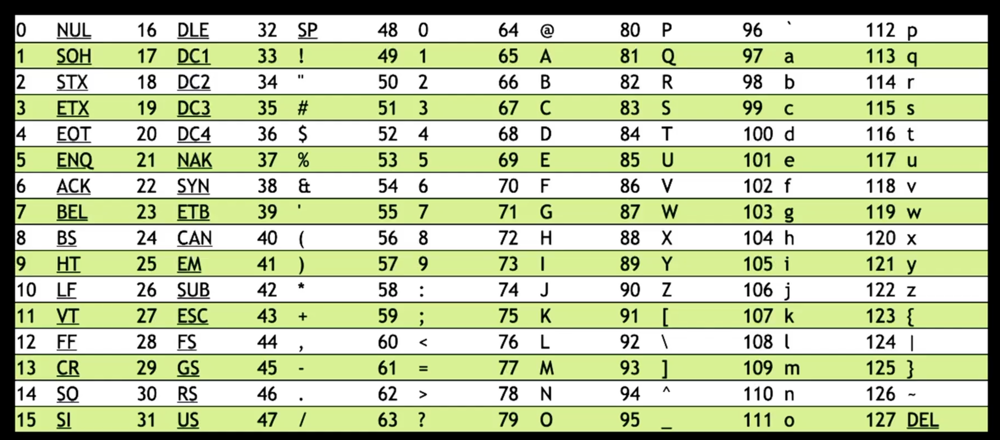
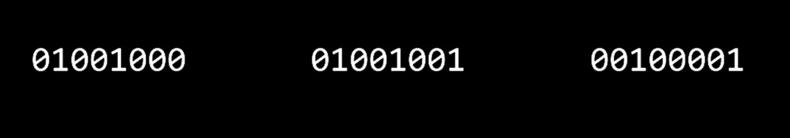
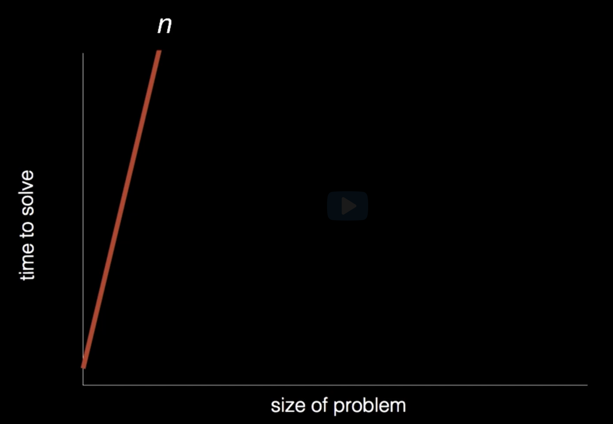
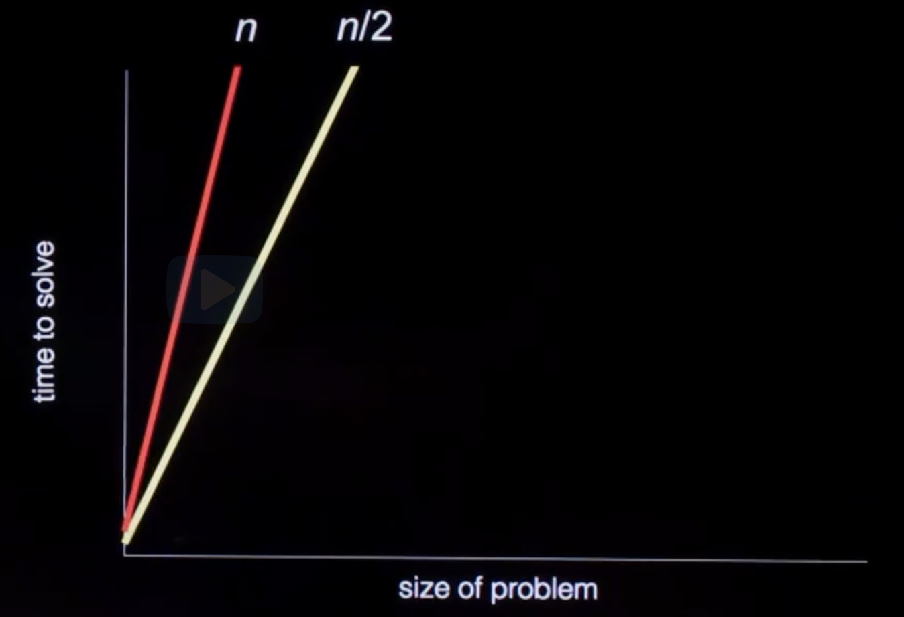
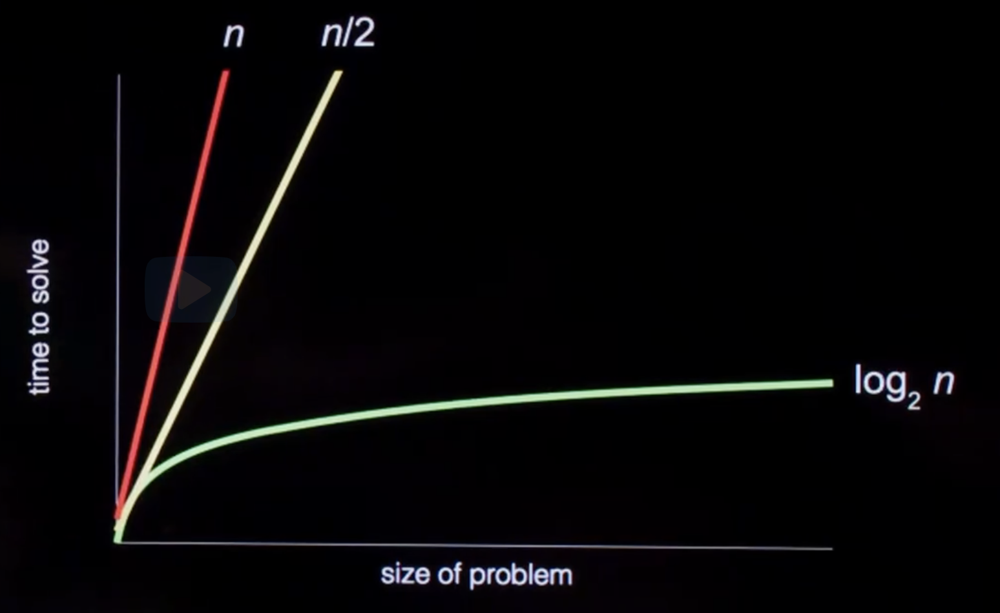

# Links

* [Lecture video](https://video.cs50.io/SlqjA04_dpk)
* [Lecture notes](https://cs50.harvard.edu/x/notes/1/#lecture-1)
* [Lecture VS Code](https://cs50.dev/)
* [Manual Pages](https://manual.cs50.io/)

# 8 Bit Calculation Cheatsheet

It's pretty simple. Just sum the corresponding numbers where the bit is equal to 1 to determine the number or letter.



A good way to remember the numbers that each of the 8 bits correspond is by starting at the right with 1 and keep multiplying by 2 as you go to the left.

# ASCII Character Bits Cheatsheet

Each ASCII character is given its own identifying number. You can use the above 8 bit formula to determine which bit pattern corresponds to which letter.



Note that uppercase characters begin at **65(A)**, and lowercase characters begin at **97(a)**.

All uppercase and lowercase ASCII characters are 32 away from each other. Essentially, the only character/number you need to know is A at 65. You can figure out the rest of this logic from there. 

Moreover, this means that you can just flip the bit that corresponds to 32 (the third bit from the left when dealing with bytes) to convert between uppercase and lowercase.

# Exercise

What pattern of 0s and 1s do these three bytes represent?



* The bytes represent the following numbers: 72, 73, 33
* According to our lil cheatsheet, these numbers represent the following ASCII characters: H, I, !

To summarize, these bytes represent "HI!"

# Unicode

Unicode is essentially an extension of ASCII where more bits were added in order to express more characters for more languages (this includes emojis as well).

# RGB

Similar to how ASCII was developed, RGB is a standardized set of numbers that represent different colors. These colors are mixed together in order to achieve various colors. 

* Each RGB color ranges 0 to 255.
* 0, 0, 0 corresponds to black.
* 255, 255, 255 corresponds to white.

**Where are these colors coming from?**

Each color is assigned to a pixel in order to create an image.

**What about animation?**

It's just a bunch of images/frames one after another (like a flip book).

# Audio

Each note can be represented by numbers as well. All you need is a way to interpret them.

# Algorithms

As you know, a big focus on algorithms is efficiency and using the minimal amount of computation or even financial resources.

In the lecture, the professor uses a phone book as an example. To find a contact, we can iterate one page at a time, yet this obviously inefficient. Instead, we can keep dividing the phone book in half to more efficiently find the contact we're looking for.

The time to solve the first example would look something like this:



As you can see, the time to solve increases far faster than the size of the problem.

However, when we start dividing the data, we get this:



It's still a straight line, but it's about twice as fast.

However, if we solved the problem logarithmically, the results are MUCH better:




Pretty simple stuff, but definitely a lot more technical in practice. This ties back to a theme in the lecture where the professor states that **code is just an implementation of an algorithm to solve a problem** (things you kinda already knew).

# Correctness, Design, Style

Code can be evaluated upon three axes:
* **Correctness:** Refers to "Does this code run as intended?"
* **Design:**: Refers to "How well is this code designed?"
* **Style:** Refers to "How aesthetically pleasing and consistent is the code?"

# Integer Overflow

Consider the following code:

```c
#include <cs50.h>
#include <stdio.h>

int main(void)
{
    int dollars = 1;
    while (true)
    {
        char c = get_char("Here's $%i. Double it and give to next person? ", dollars);
        if (c == 'y')
        {
            dollars *= 2;
        }
        else
        {
            break;
        }
    }
    printf("Here's $%i.\n", dollars);
}
```

Notice how the program repeatedly doubles the dollar amount. Eventually, the integer will exceed its maximum value and “overflow,” wrapping around to a negative number or zero.

* Integer overflow is when a calculation produces a value that exceeds the maximum storage capacity of the data type, causing the value to wrap around unexpectedly.
* Types are very important because each type has specific limits. For example, because of the limits in memory, the highest value of a **signed** (negative) `int` is typically `2147483647`, while an **unsigned** (positive) `int` can reach `4294967295`.

We can solve this issue by using a `long` variable type:

```c
#include <cs50.h>
#include <stdio.h>

int main(void)
{
    long dollars = 1;
    while (true)
    {
        char c = get_char("Here's $%li. Double it and give to next person? ", dollars);
        if (c == 'y')
        {
            dollars *= 2;
        }
        else
        {
            break;
        }
    }
    printf("Here's $%li.\n", dollars);
}
```

* Note that we use `%li` instead `%i` in the format strings.
* A `long` can store much larger values than an `int`, **delaying, but not eliminating**, the overflow problem.

You may know that integers and floating point variables have a significant difference: The ability to represent numbers less than `1`. Consider the following:

```c
#include <cs50.h>
#include <stdio.h>

int main(void)
{
    // Prompt user for x
    int x = get_int("What's x? ");

    // Prompt user for y
    int y = get_int("What's y? ");

    // Divide x by y
    printf("%i\n", x / y);
}
```

Notice that when dividing two integers, C performs integer division and truncates (discards) any decimal portion. For example, 7 / 2 would give 3, not 3.5.

* Floating point imprecision illustrates that there are limits to how precise computers can calculate numbers.

Similarly, we can `cast` an integer to be a  `float`. Consider the following:

```c
#include <cs50.h>
#include <stdio.h>

int main(void)
{
    // Prompt user for x
    int x = get_int("What's x? ");

    // Prompt user for y
    int y = get_int("What's y? ");

    // Divide x by y
    printf("%f\n", (float) x / y);
}
```

Notice how we `cast` `x` to a `float` before division using `(float) x`. This converts the integer to a floating-point number, allowing the division to produce a decimal result instead of truncating.

We could use `float`s throughout:

```c
#include <cs50.h>
#include <stdio.h>

int main(void)
{
    // Prompt user for x
    float x = get_float("What's x? ");

    // Prompt user for y
    float y = get_float("What's y? ");

    // Divide x by y
    printf("%.50f\n", x / y);
}
```

Notice that we use `get_float` for input and `%.50f` to display up to 50 decimal places, revealing the limitations of floating-point precision as the result may show unexpected digits due to binary representation constraints.
