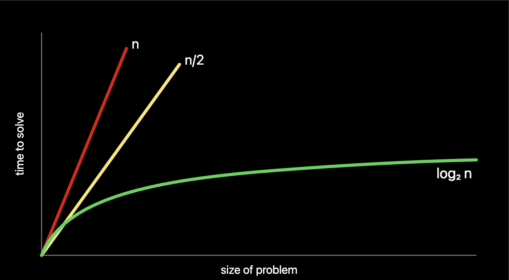
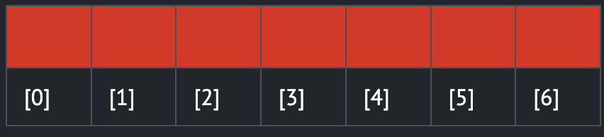
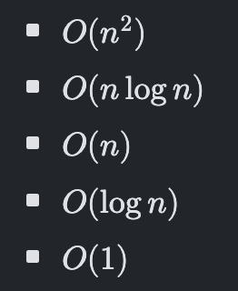
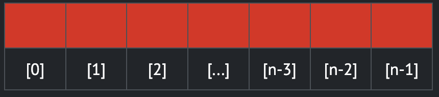

# Links

* [Lecture video](https://cs50.harvard.edu/x/weeks/3/)
* [Lecture notes](https://cs50.harvard.edu/x/notes/3/)
* [Lecture VS Code](https://cs50.dev/)
* [Manual Pages](https://manual.cs50.io/)
* [Problem Set 3](https://cs50.harvard.edu/x/psets/3/)

# Algorithms

**Big O Notation:**



# Linear Search

Let's say we have an array (that's suspiciously similar to the lockers in the lecture), like the following:



* We can imagine that we have a problem where we want to know "Is the number `50` inside the array? A computer must look at each "locker" (index) to be able to see if the number `50` is inside. This is called *searching*.
* We can hand out array to an algorithm, wherein it will search through the lockers to see if the number `50` is behind one of the doors, returning the value `true` or `false`.

Here's some pseudocode to demonstrate this:

```pseudo
For each door from left to right
  If 50 is behind door
    Return true
Return false
```

This could be translated to the following (still not actual code, but closer):

```pseudo
For i from 0 to n-1
  If 50 is behind doors[i]
    Return true
Return false
```

# Binary Search

Another method to find `50`. Assuming that the values within the lockers have been arranged from smallest to largest, the pseudocode for binary search would be like this:

```pseudo
If no doors left
  Return false
If 50 is behind middle door
  Return true
Else if 50 < middle door
  Search left half
Else if 50 > middle door
  Search right hald
```

Same as before, we can narrow this down to:

```pseudo
If no doors left
  Return false
If 50 is behind doors[middle]
  Return true
Else if 50 < doors[middle]
  Search doors[0] through doors[middle -1]
Else if 50 > doors[middle]
  Search doors[middle + 1] through doors[n - 1]
```

Notice that were doing `[middle + 1]` and `[middle -1]`, since we've already searched the middle "locker".

# Running Time

Back to the Big O baby! Rather than being ultra-specific about the mathematical efficiency of an algorithm, computer scientists discuss efficiency in terms of *the order of* various running times. Here's the graph again for you:


In the above graph, the first algorithm is *O*(*n*), or **the order of n**. The second one is *O*(*n*) as well, in that constraints are dropped in big O. The third is *O*(log *n*).

Some common running times we may see are:



* Of the running times above, *O*(*n*^2) is considered the slowest running time. *O*(1) is the fastest.
* **Linear search** was of order *O*(*n*) because it would take *n* steps in the worst case to run.
* **Binary search** was of order *O*(log *n*) because it would take fewer and fewer steps to run, even in the worst case.

**We're interested in both the worst case, or *upper bound*, and the best case, or *lower bound*.**
* The <math mathvariant="normal">&#x3A9;</mi> symbol is used to denote the **best case** of an algorithm, such as <math mathvariant="normal">&#x3A9;</mi>(log *n*).
* The <mi mathvariant="normal">&#x398;</mi> symbold is used to denote **where the upper bound and lower bound are the same**: Where the best case and worst case running times are the same.
* **Asymptotic notation** is the measure of how well algorithms performs as the input gets larger.

# search.c

An example of linear search would be as follows:

```c
#include <cs50.h>
#include <stdio.h>

int main(void) {
    int numbers[] = {20, 500, 10, 5, 100, 1, 50};

    // Search for number
    int n = get_int("Number: ");
    for (int i = 0; i < 7; i++) {
        if numbers[i] == n) {
            printf("Found\n");
            return 0;
        }
    }
    printf("Not found\n");
    return 1;
}
```

Pretty self-explainable code here. No need to elaborate. But, what if we wanted to search for a string within an array?

```c
#include <cs50.h>
#include <stdio.h>
#include <string.h>

int main(void) {
    string strings[] = {"battleship", "boot", "cannon", "iron", "thimble", "top hat"};

    // Search for string
    string s = get_string("String: ");
    for (int i = 0; i < 6; i++) {
        if (strcmp(strings[i], s) == 0) {
            printf("Found\n");
            return 0;
        }
    }
    printf("Not found\n");
    return 1;
}
```

As covered in the lecture, `strcmp` will return `0` if the strings are the same. You can interpret differences in the strings that return values greater or less than `0`, but the lecture didn't elaborate too much on this.

Visit the [CS50 manual pages](https://manual.cs50.io/3/strcmp) for more info on `strcmp`.

# phonebook.c

We can combine these ideas of both numbers and strings into a single program:

```c
#include <cs50.h>
#include <stdio.h>
#include <string.h>

int main(void) {
    string names[] = {"Kelly", "David", "John"};
    string numbers[] = {"+1-617-495-1000", "+1-617-495-1000", "+1-949-468-2750"};

    // Search for name
    string name = get_string("Name: ");
    for (int i = 0; i < 3; i++) {
        if (strcmp(names[i], name) == 0) {
            printf("Found %s\n", numbers[i]);
        }
    }
    printf("Not found\n");
    return 1;
}
```

Again, pretty self-explainable code here. The index of both the name and number are assumed to be the same.

However, now we are *finally* being introduced to structs!

# Structs

Building off the previous example, it'd clearly be better to have the names more tightly associated with the numbers. So... stucts!

Here's how you define a struct:

```c
typedef struct {
    string name;
    string number;
} person;
```

Now let's implement this struct into the example:

```c
#include <cs50.h>
#include <stdio.h>
#include <string.h>

typedef struct {
    string name;
    string number;
} person;

int main(void) {
    // Create an array of 3 structs
    person people[3];

    people[0].name = "Kelly";
    people[0].number = "+1-617-495-1000";

    people[1].name = "David";
    people[1].number = "+1-617-495-1000";

    people[2].name = "John";
    people[2].number = "+1-949-468-2750";

    // Search for name
    string name = get_string("Name: ");
    for (int i = 0; i < 3; i++) {
        if (strcmp(people[i].name, name) == 0) {
            printf("Found %s\n", people[i].number);
            return 0;
        }
    }
    printf("Not found\n");
    return 1;
}
```

Since this confused you a lil, notice that we define the array with length `3`, when you'd assume that we'd define it as `2`, since you're used to zero indexing. Well... apparently zero indexing doesn't apply when creating arrays. In that instance, the number you see in the array definition is literal, but you still need to create structs from `0` to `2`. Strange, but that's the way it is.

# Sorting and Selection Sort

* When a list is sorted, searching that list is far less taxing on the computer. Recall that **we can use binary search on a sorted list but not an unsorted one**.
* There are many different types of sorting algorithms, **selection sort** being one of them.

We can represent an array as follows:



The algorithm for selection sort in pseudocode is:

```pseudo
For i from 0 to n-1
  Find the smallest number between numbers[i] and numbers[n-1]
  Swap smallest number with numbers[i]
```

Summarizing those steps, the first time iterating through the list takes `n-1` steps. The second time, it takes `n - 2` steps. Carrying this logic forward, the steps required could be represented as follows:

```
(n - 1) + (n - 2) + (n - 3) + ... + 1
```

This could be simplifies to n(n-1)/2 or, more simply, *O*(*n*^2). In th worst case, or upper bound, selection sort is in the order of *O*(*n*^2). In the best case, or lower bound, selection sort is in the order of <math mathvariant="normal">&#x3A9;</mi>(*n*^2).

# Bubble Sort

Bubble sort works by repeatedly swapping elements to "bubble" larger elements to the end.

The pseudocode for bubble sort is:

```pseudo
Repeat n-1 times
  For i from 0 to n-2
    If numbers[i] and numbers[i + 1] out of order
      Swap them
    If no swaps
      Quit
```

* As we further sort the array, we know more an more of it becomes sorted, so we only need to look at the pairs of numbers that haven't been sorted yet.
* Bubble sort can be analyzed as follows:
  * (n - 1) * (n - 1)
  * n^2 - n - n + 1
  * n^2 - 2n + 1
  * or, more simply *O*(*n*^2)

In the worst case or upper bound, bubble sort is in the order of 𝑂(𝑛2). In the best case or lower bound, bubble sort is in the order of Ω(𝑛).

# Recursion

Recursion is when a function calls itself. We saw this earlier here:

```pseudo
If no doors left
    Return false
If number behind middle door
    Return true
Else if number < middle door
    Search left half
Else if number > middle door
    Search right half
```

Notice that we're calling `search `on smaller and smaller iterations of this problem.
* A **base case** is defined as the condition that stops the recursion from continuing indefinitely, preventing infinite loops.
* A **recursive case** is defined as the part of the recursive function that calls itself with a modified input, moving toward the base case.

Consider how in week 1 we wanted to create a pyramid structure like this:

```
#
##
###
####
```

We accomplished this with a loop like so:

```c
#include <cs50.h>
#include <stdio.h>

void draw(int n);

int main(void) {
    int height = get_int("Height: ");
    draw(height);
}

void draw(int n) {
    for (int i = 0; i < n; i++) {
        for (int j = 0; j < i + 1; j++) {
            printf("#");
        }
        printf("\n");
    }
}
```

To implement this using recursion, we could write it as follows:

```c
#include <cs50.h>
#include <stdio.h>

void draw(int n);

int main(void) {
    int height = get_int("Height: ");
    draw(height);
}

void draw(int n) {
    // Base case
    if (n <= 0) {
        return;
    }

    // Draw pyramid of height n -1
    draw(n - 1);

    // Draw one more row of width n
    for (int i = 0; i < n; i++) {
        printf("#");
    }
    printf("\n");
}
```

Notice the base case will ensure the code does not run forever. The line `if (n <= 0)` terminates the recursion because the problem has been solved. Every time `draw` calls itself, it calls itself with `n-1`. At some point, `n-1` will equal `0`, resulting in the `draw` function returning, and the program will end.

As a personal note, recursion might sound more scary than it actually is. While I assume it can be much more complex, the examples we've looked at thus far seem to require you to just define a base case and input part of a formula into the recursion function call. Suspiciously simple so far.

However, where it does get a little more complicated is how it kind of seems like magic the way it works, which leads us to **call stacks**.

## The Call Stack

When you call a function, the system sets aside space in memory for that function to do its necessary work. We frequently call such chunks of memory **stack frames** or **function frames**.

More than one function's stack frame may exist in memory at a given time. If `main()` calls `move*()`, which then calls `direction()`, all three functions have open frames.

But, *in general*, **only one of these frames is ever active at one time**, despite all of them having memory space set aside.

Resuming the notes from the video, these frames are arranged in a **stack**. The frame for the most recently called function is always on top of the stack.

When a new function is called, a new frame is **pushed** onto the top of the stack and becomes the active frame.

When a function finishes its work, its frame is **popped** off of the stack, and the frame immediately below it becomes the new, active, function on the top of the stack. This functions picks up immediately where it left off.

Let's take a function that calculates factorials for instance:

```c
#include <stdio.h>

int fact(int n);

int main(void) {
    printf("%i\n", fact(5));
}

int fact(int n) {
    if (n == 1)
        return 1;
    else
        return n * fact(n-1);
}
```

* The first thing `main()` does is call another function `printf()`. As soon as it does that, `main()` is effectively on pause and waiting for `printf()` to do its thing.
* However, since `printf()` also calls the function `fact()`, `printf()` is also put on pause. In other words, `fact()` is **pushed** to the top of the stack, same as `printf()` was before the code reached `fact()`.
* Then, `fact()` is repeated until it hits the limit of `n-1`. Note the `fact(4)` all the way down to `fact(1)` are on pause until the code fulfills the current factorial (in this case, `facty(5)`).

# Merge Sort

We can now leverage recursion in our quest for a more efficient sort algorithm and implement what is called a merge sort, a very efficient sort algorithm.

The pseudocode for merge sort is quite short:

```
If only one number
  Quit
Else
  Sort left half of numbers
  Sort right hald of numbers
  Merge sorted halves
```

Consider the following list of numbers:

```6341```

First, merge sort asks, "Is this one number? The answer is "no," so the algorithm continues.

```6341```

Second, merge sort will now split the numbers down the middle (or as close as it can get) and sort the left half of numbers.

```63|41```

Third, merge sort would look at these numbers on the left and ask "Is this one number?" Since the answer is no it would then split the numbers on the left down the middle.

```6|3```

Fourth, merge sort will again ask, "Is this one number?" The answer is yes this time! Therefore, it will quit this task and return to the last task it was running at this point:

```63|41```

Fifth, merge sort will sort the numbers on the left.

```36|41```

Now, we return to where we left off in the pseudocode now that the left side has been sorted. A similar process of steps 3-5 will occur with the right-hand numbers. This will result in:

```36|14```
